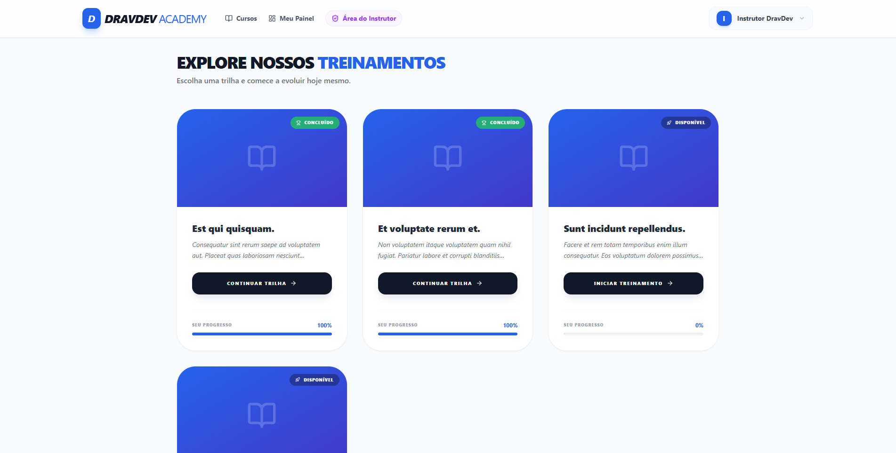
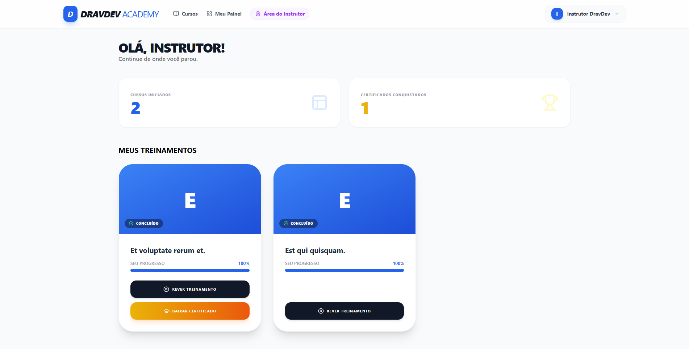
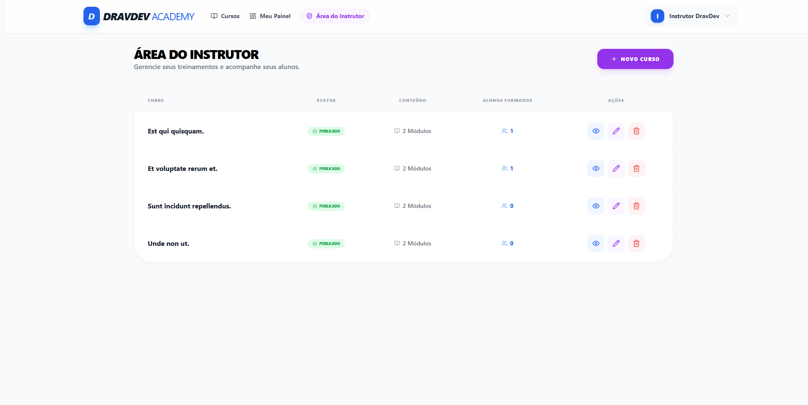
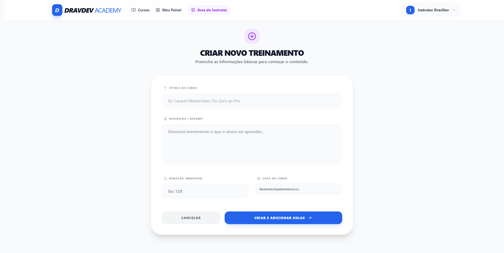
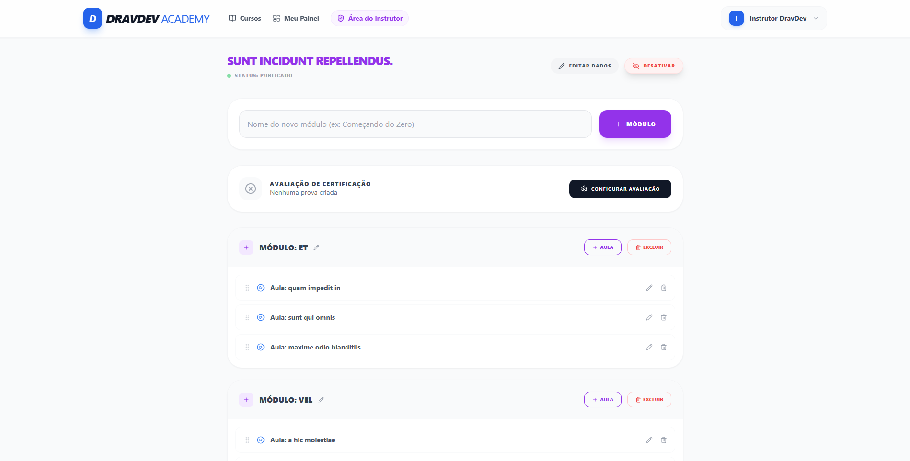
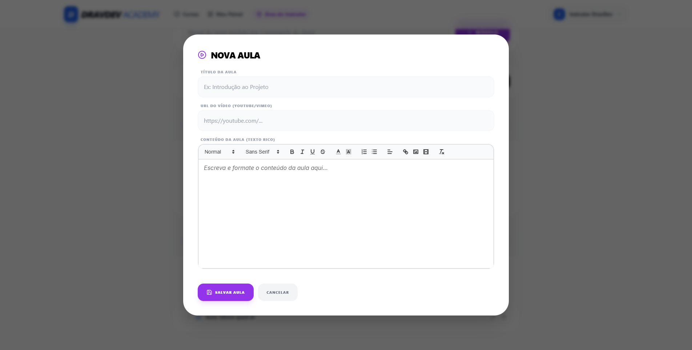
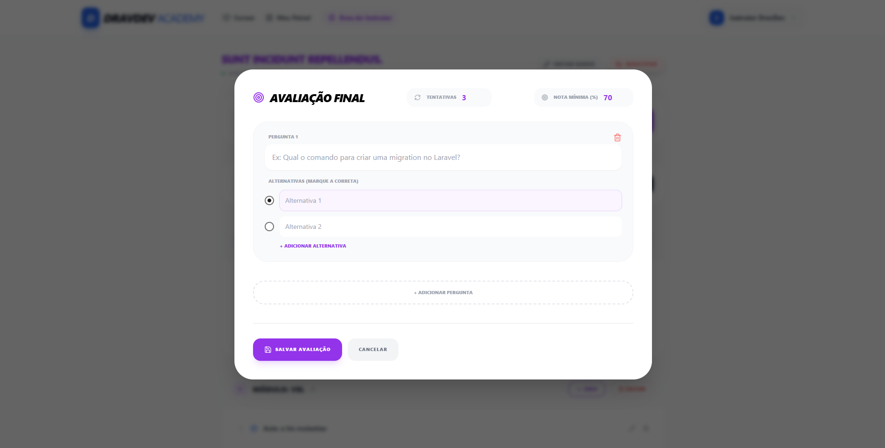
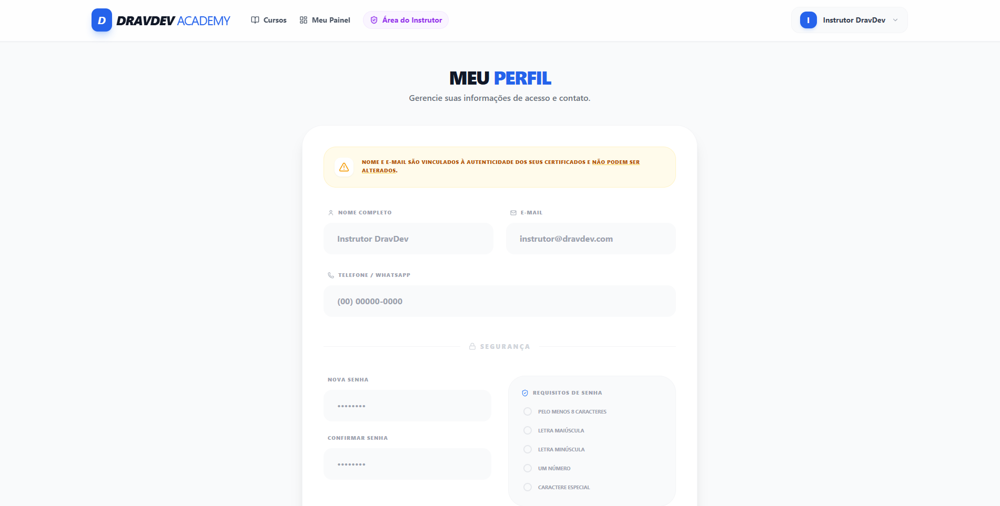

# 🎓 DravDev Academy - LMS Platform

    

Sistema de Gestão de Aprendizagem (LMS) robusto e moderno, desenvolvido para centralizar e organizar treinamentos corporativos. Uma solução Fullstack focada em performance, segurança e uma experiência de usuário (UX) de alto nível.

## 🚀 Tecnologias Utilizadas

### Back-end
- **Laravel 12**: Framework PHP de última geração para uma API sólida.
- **SQLite/MySQL**: Flexibilidade no armazenamento de dados (Configurado via `.env`).
- **Eloquent ORM**: Gestão eficiente de relacionamentos complexos e ordenação inteligente.
- **DomPDF**: Geração dinâmica de certificados em PDF com validação de carga horária.

### Front-end
- **React + TypeScript**: Interface reativa com tipagem estrita para maior manutenibilidade.
- **Tailwind CSS**: Estilização moderna e responsiva com foco em design system corporativo.
- **Lucide React**: Iconografia vetorial consistente e elegante em toda a plataforma.
- **Axios**: Comunicação otimizada com a API através de interceptors (Configurado via `.env`).
- **Canvas Confetti**: Gamificação visual para celebrar a conclusão de treinamentos.

---

## 📸 Galeria do Sistema

*Uma visão geral da interface limpa e funcional*

### Vitrine de Cursos
*Cursos disponíveis na página inicial do sistema.*


### Painel de Acompanhamento
*Ambiente para acompanhar cursos iniciados e concluídos.*


### Painel do Instrutor
*Ambiente para gerenciar os cursos criados na plataforma.*






### Menu de Perfil


---

## 🛠️ Como rodar o projeto

### 1. Clonar repositório
```bash
git clone https://github.com/icarocarvalho15/dd-lms.git
cd dd-lms
```

### 2. Back-end (Api)
```bash
cd api
composer install
# Caso use SQLite: touch database/database.sqlite
cp .env.example .env
php artisan key:generate
php artisan storage:link
php artisan migrate --seed
php artisan serve
```

### 3. Front-end (Client)
```bash
cd client
npm install
cp .env.example .env # Configure o VITE_API_URL no seu .env
npm run dev
```

---

## 📋 Funcionalidades Principais

**👨‍🎓 Experiência do Aluno**
- **Dashboard Dinâmico**: Visualização em tempo real de estatísticas e progresso individual.
- **Trilha de Aprendizado Blindada**: Navegação inteligente que respeita a ordem das aulas.
- **Player de Aula Otimizado**: Sidebar sticky e controle de progresso automático por vídeo ou tempo de leitura.
- **Certificação Automática**: Emissão imediata de certificados ao atingir 100% de conclusão + aprovação em quiz.
- **Perfil de Segurança**: Gestão de dados pessoais com validação de requisitos de senha.
- **Sistema de Rating**: Avaliação de cursos (1-5 estrelas) com feedback textual opcional após a conclusão de 100% das aulas.

**👨‍🏫 Gestão do Instrutor**
- **Painel Administrativo**: Visão geral de cursos, alunos formados e status de publicação.
- **Construtor de Conteúdo**: CRUD completo de Módulos e Aulas com suporte a arrastar-e-soltar (Drag & Drop).
- **Editor de Texto Rico**: Integração com ReactQuill para materiais didáticos formatados.
- **Gestão de Mídia Inteligente**: Sistema que limpa arquivos físicos do servidor ao excluir ou atualizar capas.

---

## 🚀 Sprint: Sistema de Certificação e Avaliações

Transformamos a plataforma em uma escola real, focada em validação de conhecimento e consistência estética.

### 🆕 Novidades
- **Sistema de Quizzes Dinâmicos**: Configuração de avaliações finais com nota mínima e limite de tentativas.
- **Arquitetura Desacoplada**: `QuizController` independente para gestão de perguntas e correção automática via backend.
- **Segurança de API**: Bloqueio de tentativas excedentes (Status 403) e proteção de endpoints de certificação.
- **UI/UX Reativa**: Padronização completa de ícones via Lucide React e alinhamentos em Flexbox.

### 🛠️ Tecnologias/Padrões Implementados
- **Eager Loading**: Otimização de queries para evitar o problema N+1 no carregamento do Dashboard.
- **Navegação SPA**: Implementação de `useNavigate` para transições de página fluidas e sem refresh.
- **Persistência de Dados**: Sincronização imediata entre aprovação no Quiz e liberação do hash de certificado.

---

## 🍰 Sobre a Drav Dev

Este projeto foi desenvolvido com dedicação pela **Drav Dev** como parte do nosso portfólio de soluções de software customizadas. Ele demonstra nossa capacidade de construir aplicações full-stack complexas, seguras e com foco na experiência do usuário.

Desenvolvido por Ícaro Carvalho.

*v0.1.1 - Release "complete rating system with student feedback and instructor dashboard"*
---
  